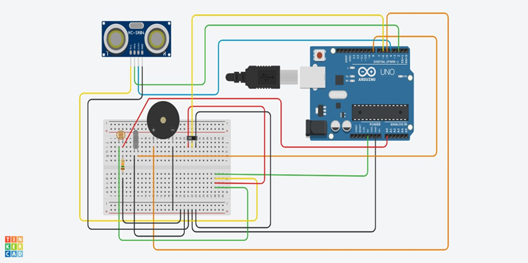
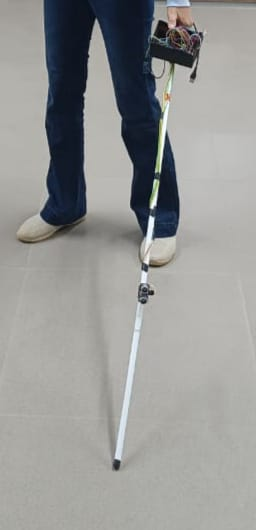

# **Smart Walking Cane for the Visually Challenged**

## **Project Overview**

The Smart Walking Cane is an embedded system designed to assist visually challenged individuals in navigating their surroundings more safely and independently. This innovative solution integrates multiple sensors and technologies into a sturdy, user-friendly walking stick to detect obstacles, alert the user, and ensure safety under varying conditions.

---

## **🌟 Objectives**

- Design a simple, elegant, and pocket-friendly device.
- Enhance accessibility and usability for the visually impaired and the general public.
- Ensure a sturdy construction that withstands frequent use and accidental drops.
- Develop an intuitive system synchronized with a user-friendly mobile app.
- Offer real-time obstacle detection and emergency SOS features.

---

## **🔧 Components**

- **Arduino UNO** – The central microcontroller for controlling sensors and processing data.
- **Ultrasonic Sensor** – Detects obstacles in front of the user by emitting and receiving ultrasonic waves.
- **Gyroscope (MPU6050)** – Monitors the orientation and movement of the cane to enhance stability and motion detection.
- **Buzzer** – Provides auditory alerts when an obstacle is detected or during emergency situations.
- **Light Dependent Resistor (LDR)** – Automatically turns on an LED in low-light environments to improve visibility and notify others of the user’s presence.
- **Vibrational Sensor** – Detects collisions or impacts and provides immediate feedback.
- **Bluetooth Module** – Enables wireless communication with the smartphone app for monitoring and configuration.
- **SOS Button** – Allows the user to send an emergency alert easily.
- **Collapsible Walking Stick** – Durable and portable design suitable for daily use.
- **Battery** – Powers the entire system.
- **Breadboard & Jumper Wires** – For prototyping and connecting components.

---

## **📖 Methodology**

1. **Obstacle Detection**
   - The Ultrasonic Sensor continuously scans the front area for objects within a predefined range (2 cm to 5 m).
   - Upon detection, information is transmitted to the Arduino UNO.

2. **Alert System**
   - The buzzer sounds progressively faster as the obstacle gets closer.
   - The LDR controls an LED, which activates automatically in low-light conditions.
   - The Vibrational Sensor triggers additional alerts when collisions occur.

3. **User Emergency**
   - The SOS button allows the user to trigger an emergency alert via Bluetooth to the connected app.

4. **Sturdiness & Portability**
   - The collapsible design ensures easy transport and a sturdy structure resistant to accidental drops.

---

## **⚡ Features**

- Real-time obstacle detection and alerts.
- Visual and auditory signals for low-light environments.
- Collision detection with instant warnings.
- Emergency SOS functionality.
- Bluetooth connectivity for app integration.
- Compact and collapsible design.

---

## **🛠️ Circuit Diagram**

---

## ** Prototype Image**

---

## **🎯 Future Enhancements**

- Integrate GPS for real-time location tracking.
- Implement voice feedback for obstacle descriptions.
- Design a fully enclosed PCB for better portability.

